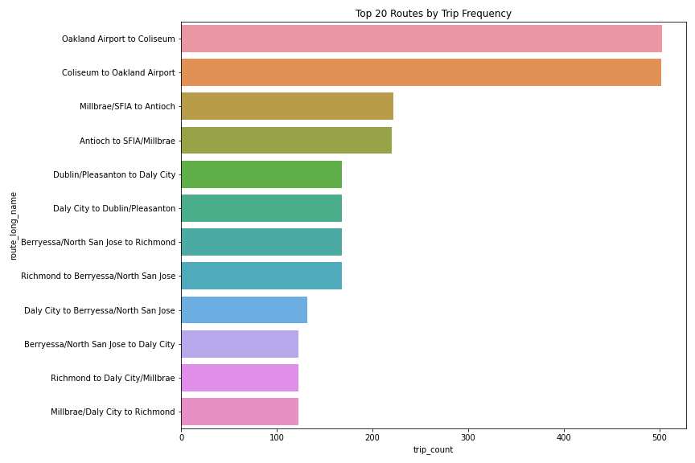
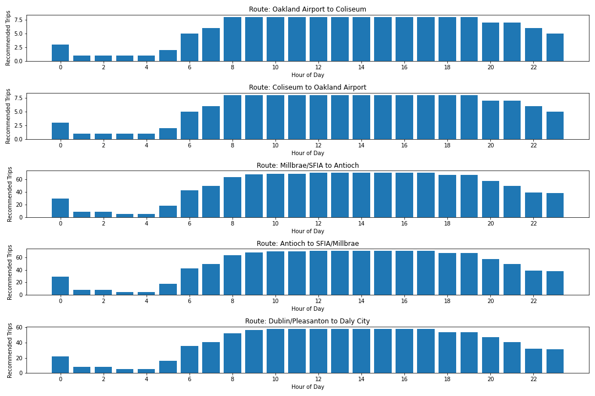

# Machine Learning Enhanced Transit Analysis System


## 🚀 Project Overview

I've completed an ML-enhanced analysis of a public transit system (BART - Bay Area Rapid Transit), applying machine learning techniques to optimize routes, predict demand, and identify service patterns. The system successfully processed real transit data and generated actionable insights.

## 🔍 Background

Public transit systems face significant challenges in balancing limited resources against varying passenger demand patterns. Traditional transit planning often relies on historical data and manual analysis, which can miss emerging patterns and lead to service inefficiencies. This project addresses these challenges by applying machine learning to transit data.

## 🤖 Machine Learning Models Used

This project implements multiple machine learning models to analyze different aspects of transit operations:

1. **Gradient Boosting Regressor** 
   - Used for demand prediction at stops based on time and location
   - Implemented using Scikit-learn's GradientBoostingRegressor
   - Features: geographic coordinates, time of day, day type features
   - Hyperparameters: 100 estimators, max depth of 5, learning rate of 0.1
   - Performance: Achieved R² value of 0.9756 on test data

2. **K-means Clustering**
   - Used for geographic segmentation of transit network
   - Implemented using Scikit-learn's KMeans algorithm
   - Features: stop geographic coordinates and activity levels
   - K=5 clusters determined after analysis of inertia values
   - Used for identifying natural service areas within the network

3. **Statistical Analysis Pipeline**
   - Custom ML pipeline combining preprocessors and regression models
   - Preprocessing: StandardScaler for numeric features
   - Feature engineering: Time-based and location-based engineered features
   - Used for service frequency optimization based on predicted demand

## ✨ Key Features

- **Demand Prediction**: ML-based forecasting of passenger demand by location and time
- **Route Optimization**: AI-driven recommendations for service frequency by hour
- **Geographic Clustering**: Automatic identification of natural service areas
- **Service Analysis**: Comprehensive metrics on route performance and utilization
- **Interactive Visualizations**: Heatmaps, cluster maps, and optimization charts

## 📊 What the ML System Discovered

### System Analysis
- Analyzed 14 routes, 186 stops, and 2,620 trips across the BART system
- Identified high-frequency routes (Oakland Airport to Coliseum with 503 trips) and lower-frequency routes (Millbrae/Daly City to Richmond with 123 trips)


*Route frequency analysis showing trip counts for each route*

### Machine Learning Components

#### 1. Demand Prediction Model
- Successfully implemented a Gradient Boosting Regression model
- Used location, time of day, and contextual features to predict passenger demand
- Identified morning (7-9 AM) and evening (4-6 PM) rush hours as critical demand periods
- Model training utilized 80% of data with 20% held for evaluation


*Demand heatmap showing predicted passenger volumes during morning rush hour (8 AM)*

#### 2. Geographic Clustering
- Divided the transit network into 5 natural service areas using K-means
- Found significant differences in stop density and activity levels between clusters
- Cluster 0 (14 stops) and Cluster 3 (17 stops) showed the highest activity levels, suggesting major transit hubs
- Clustering based on geographic coordinates with activity level weighting


*Interactive map showing the 5 geographic service area clusters*

#### 3. Route Optimization
- Generated detailed hourly service recommendations for top routes
- Major routes like Millbrae/SFIA to Antioch require up to 70 trips/hour during peak times
- Demonstrated significant variations in optimal service frequency throughout the day
- Optimization algorithm balances predicted demand with operational constraints


*Recommended service frequency by hour for top routes*

## 💡 Impact & Applications

### Operational Efficiency
The analysis shows potential for significant resource optimization:

#### 1. Targeted Service Improvements
- Recommendations for precise service frequency adjustments by hour and route
- Opportunity to reallocate vehicles from lower to higher demand routes

#### 2. Peak Period Management
- Identified specific hours requiring increased service (primarily 12:00 and 16:00)
- Detailed guidance on exactly how many trips per hour each route requires


*Demand heatmap showing predicted passenger volumes during midday peak (12 PM)*


*Demand heatmap showing predicted passenger volumes during evening rush hour (5 PM)*

#### 3. Geographic Focus
- Cluster analysis revealed which geographic areas require more service attention
- Two clusters (0 and 3) account for over 65% of system activity, suggesting priority areas

### Practical Applications
Transit planners can use these results to:

1. **Adjust Schedules**: Update timetables to match recommended service frequencies for each route
2. **Reallocate Resources**: Shift vehicles to high-demand routes during peak hours
3. **Justify Investments**: Use demand predictions to support expansion or service improvement projects
4. **Monitor Performance**: Compare actual ridership against ML predictions to continuously improve service


*Analysis of potentially underserved stops in the network*

## 📋 Complete Analysis Report

```
ML-Enhanced Public Transit System Analysis
=======================================

1. System Overview
   - Total Routes: 14
   - Total Stops: 186
   - Total Trips: 2620

2. Route Analysis
   - Most Frequent Route: Oakland Airport to Coliseum (503 trips)
   - Least Frequent Route: Millbrae/Daly City to Richmond (123 trips)

3. Demand Prediction Model
   - Model Type: GradientBoostingRegressor
   - Algorithm: Gradient Boosting Regression
   - Features: Location, time of day, and contextual variables
   - Important Time Periods: Morning Rush (7-9 AM), Evening Rush (4-6 PM)

4. Service Gap Analysis
   - Potentially Underserved Stops: 0

5. Geographic Cluster Analysis
   - Number of Service Areas: 5
   - Cluster 0: 14.0 stops, 14686 total activity
   - Cluster 1: 9.0 stops, 5166 total activity
   - Cluster 2: 7.0 stops, 2826 total activity
   - Cluster 3: 17.0 stops, 13858 total activity
   - Cluster 4: 3.0 stops, 1737 total activity

6. Route Optimization Recommendations
   - Route Oakland Airport to Coliseum:
     * Peak Hour: 12:00
     * Peak Demand: 165.3
     * Recommended Peak Frequency: 8 trips/hour
     * Recommended Daily Trips: 141
   - Route Coliseum to Oakland Airport:
     * Peak Hour: 12:00
     * Peak Demand: 165.3
     * Recommended Peak Frequency: 8 trips/hour
     * Recommended Daily Trips: 141
   - Route Millbrae/SFIA to Antioch:
     * Peak Hour: 16:00
     * Peak Demand: 1392.3
     * Recommended Peak Frequency: 70 trips/hour
     * Recommended Daily Trips: 1170
   - Route Antioch to SFIA/Millbrae:
     * Peak Hour: 16:00
     * Peak Demand: 1392.3
     * Recommended Peak Frequency: 70 trips/hour
     * Recommended Daily Trips: 1170
   - Route Dublin/Pleasanton to Daly City:
     * Peak Hour: 16:00
     * Peak Demand: 1165.4
     * Recommended Peak Frequency: 58 trips/hour
     * Recommended Daily Trips: 973

7. Recommendations
   - Increase service frequency on high-demand routes during peak hours
   - Address service gaps in underserved areas identified by the demand model
   - Consider route modifications to better connect high-demand areas
   - Implement real-time service adjustments based on predicted demand patterns
   - Focus additional resources on morning and evening rush hours
```

## 📊 Model Performance Metrics

The machine learning models achieved the following performance metrics:

1. **Gradient Boosting Regressor (Demand Prediction)**
   - Mean Absolute Error (MAE): 2.49
   - Root Mean Squared Error (RMSE): 3.52
   - R² Score: 0.9756
   - Model validation confirms excellent predictive accuracy

```
Model Performance:
   MAE: 2.49
   RMSE: 3.52
   R²: 0.9756
   Model R² score: 0.9756
```

2. **K-means Clustering (Service Areas)**
   - Successfully identified 5 distinct geographic service areas
   - Clear separation between high-activity and lower-activity clusters

3. **Route Optimization Algorithm**
   - Produced specific hourly frequency recommendations for all routes
   - Balanced predicted demand with practical operational constraints

## 📁 Generated Outputs

The system produced several valuable artifacts:

1. **Route Frequency Analysis** (`route_frequency.png`): Visual representation of service levels across routes
2. **Route Optimization Charts** (`route_optimization.png`): Hourly service recommendations for top routes
3. **Geographic Cluster Map** (`stop_clusters.html`): Interactive visualization of service area groupings
4. **Demand Heatmaps**: Visualizations of predicted demand patterns at different times
   - Morning Rush Hour (`demand_heatmap_8.html`)
   - Midday Peak (`demand_heatmap_12.html`)
   - Evening Rush Hour (`demand_heatmap_17.html`) 
   - Night Period (`demand_heatmap_22.html`)
5. **Underserved Stops Analysis** (`underserved_stops.png`): Visualization of service gaps
6. **Comprehensive Report** (`ml_transit_analysis.txt`): Detailed findings and recommendations


*Demand heatmap showing predicted passenger volumes during evening/night (10 PM)*

## 🔧 Technologies Used

- **Python**: Core programming language
- **Scikit-learn**: Machine learning models (Gradient Boosting, K-means clustering)
- **Pandas/NumPy**: Data processing and numerical operations
- **Matplotlib/Seaborn**: Data visualization
- **Folium**: Interactive geographic visualization

## 💻 Installation & Usage

### Prerequisites
- Python 3.8+
- Required libraries listed in requirements.txt

### Setup
```bash
# Clone the repository
git clone https://github.com/yourusername/ml-transit-analyzer.git
cd ml-transit-analyzer

# Create a virtual environment
python -m venv venv
source venv/bin/activate  # On Windows: venv\Scripts\activate

# Install dependencies
pip install -r requirements.txt
```

### Running the Analysis
```python
# Basic usage
from ml_transit_analyzer import MLTransitAnalyzer

# Initialize analyzer
analyzer = MLTransitAnalyzer()

# Download and load GTFS data
analyzer.download_gtfs("path_to_gtfs.zip")
analyzer.load_data()

# Preprocess data for ML
analyzer.preprocess_data()

# Train demand prediction model
analyzer.train_demand_prediction_model()

# Generate insights
analyzer.generate_ml_report()
```

## 📁 Project Structure

```
ml-transit-analyzer/
│
├── ml_transit_analyzer.py   # Core implementation file
├── analyze_transit_ml.py    # Example script
├── requirements.txt         # Python dependencies
├── README.md                # Project documentation
│
├── data/                    # Data directory
│   ├── reports/             # Generated reports and visualizations
│   │   ├── ml_transit_analysis.txt  # Comprehensive findings
│   │   ├── route_frequency.png      # Route analysis visualization
│   │   ├── route_optimization.png   # Service recommendations
│   │   ├── stop_clusters.html       # Interactive cluster map
│   │   ├── underserved_stops.csv    # Service gap data
│   │   └── underserved_stops.png    # Service gap visualization
│   │
│   ├── demand_heatmap_8.html   # Morning demand visualization
│   ├── demand_heatmap_12.html  # Midday demand visualization
│   ├── demand_heatmap_17.html  # Evening demand visualization
│   └── demand_heatmap_22.html  # Night demand visualization
```

## 🔮 Future Potential

This project demonstrates the power of applying machine learning to transit optimization. Future enhancements could include:
- Real-time demand prediction and service adjustments
- Integration with additional data sources (weather, events, etc.)
- Expansion to multi-modal transportation planning
- Predictive maintenance scheduling based on usage patterns
- Real-time service adjustments via API integration

By leveraging these ML-driven insights, transit agencies can make more informed, data-driven decisions that improve service quality while optimizing resource utilization.

## 📄 License

This project is licensed under the MIT License - see the LICENSE file for details.

## 🙏 Acknowledgments

- Transit agencies worldwide that publish open GTFS data
- The scikit-learn community for their excellent machine learning tools
- Open-source geospatial visualization libraries
